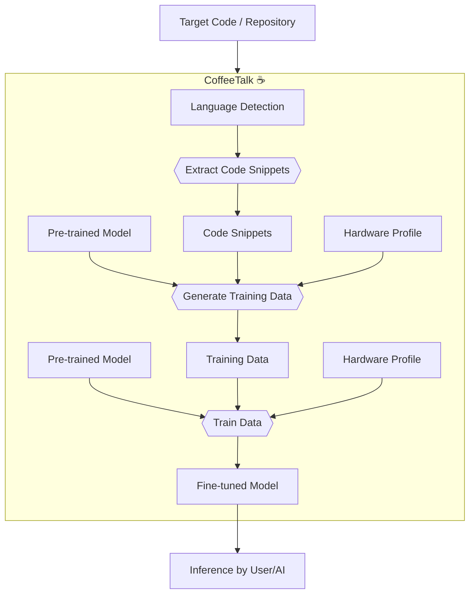

# CoffeeTalk ☕

CoffeeTalk is a tool that transforms codebases into fine-tuned language models. It offers flexible training configurations tailored to various hardware profiles, accommodating both memory-constrained systems and high-performance setups. This makes it accessible for developers with a wide range of hardware resources.

CoffeeTalk can be used by developers to enhance code understanding, automate code documentation, and generate highly contextual code explanations. It can also serve as a backend for AI systems that require deep code comprehension capabilities, enabling them to assist in code reviews, refactoring, and debugging. By integrating CoffeeTalk, both human developers and AI systems can leverage its capabilities to improve productivity and code quality through a nuanced understanding of code context.

## Setup and Usage

1. **Create a virtual environment:**
   ```
   python -m venv venv
   ```
2. **Activate the virtual environment:**
   
   On Mac/Linux:
   ```
   source venv/bin/activate
   ```
3. **Install the required dependencies:**
   ```
   pip install -r requirements.txt
   ```
4. **Run the script:**

   Note: If `TARGET_REPO_PATH` is not set, you will be prompted. Set it via an environment variable or pass it as a command-line argument, e.g., `TARGET_REPO_PATH="/path/to/repo" python src/main.py`.
   ```
   python src/main.py
   ```

   For verbose output:
   ```
   python src/main.py -v
   ```
5. **Deactivate the virtual environment:**
   ```
   deactivate
   ```

## Process Diagram



## Configuration

### Hardware Profiles

CoffeeTalk supports different hardware profiles to optimize training for various systems. The profiles are defined in `src/hardware_profiles.py` and can be selected by setting the `HARDWARE_PROFILE` environment variable. Available profiles include:

- **apple_silicon**: Optimized for Apple Silicon Macs with limited memory.
- **cuda_gpu**: For systems with CUDA-enabled GPUs.
- **cpu**: For CPU-only systems.

### Model Selection

You can choose the model to use for training by setting the `TRAINING_MODEL` environment variable. If not set, the script defaults to `distilgpt2`, which is a highly memory-efficient model.

## Testing

CoffeeTalk uses pytest for testing. After installing the dependencies, you can run tests using any of these commands:

1. **Run all tests:**
   ```
   pytest
   ```
2. **Run with verbose output:**
   ```
   pytest -v
   ```
3. **Run with coverage report:**
   ```
   pytest --cov=src
   ```
4. **Run a specific test file:**
   ```
   pytest tests/test_language_extractors.py
   ```

## TODO

- Add more tests
- Specify versions in requirements.txt


